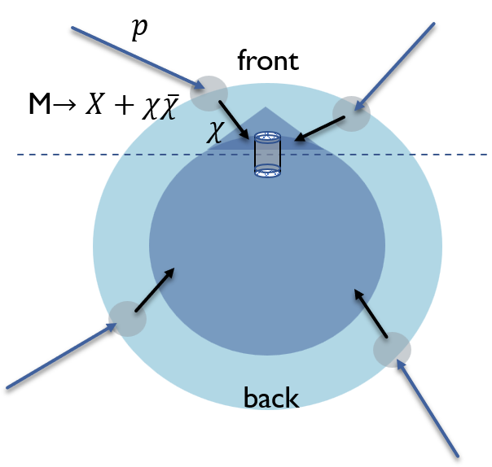

# PandaX_Attenuation

This is the underground DM simulation code for PandaX experiment, used in [arXiv:2301.03010](https://arxiv.org/abs/2301.03010). 

- This code contains MC simulation from the front side of the detector which contains the structure of Jinping mountain, and the back side of the detector, with the assumption that the earth is a sphere.

- This code is for hardrophilic DM model with details describe in [arXiv:2301.03010](https://arxiv.org/abs/2301.03010). The initial flux is acquired from [arXiv:1905.05776](https://arxiv.org/abs/1905.05776) by setting a transparent earth. The data of quasi-elastic cross section is acquired according to [arXiv:2212.02286](https://arxiv.org/abs/2212.02286). More assmuptions can be tested by changing to corresponding differential cross sections. 

# Requirements
 ROOT 6.18

 gcc 6.2.0

 HTcondor

# Installation
To download it via git, run:
`git clone `

Create new folders:
`mkdir bin build output log`

The code is compiled using the Makefile. To compile the code simply run

`make all`

Folder structure:

    /bin/: After successful compilation this folder contains two executables.

    /build/: This folder contains all object files.

    /dat/: This folder contains all input datas needed for simulation, including:

        -JP mountain structure

        -DM flux before attenuation taken from arXiv:1905.05776.

        -Information about elastic and quasi-elastic cross-section taken from arXiv:2212.02286

        -A custom list file with:

            DM mass[MeV]    reference cross section[cm^2]  mediator mass[MeV]

        in each line. An example file dat/list.lst is provided here.

    /src/: Source code files for simulation, with DM coming from front and back.

    /script/: This folder contains script files in shell or ROOT, used for submiting MC simulation to condor, and processing the output MC files to recoil spectrum. 

    /output/: This folder contains all result files

    /log/: This folder is for log files generated by condor

# Usage

After compile, we use condor to accelerate the simulation. 

All required parameters can be adjusted in 

    /script/submit.sh

for DM from the front of PandaX detector and 

    /script/submit2.sh

for DM from the back.

Then run

`./sumbit.sh`

and 

`./sumbit2.sh`

The output ROOT files contains each step of the simution. 

Then run

`./sumbit_process.sh`

The final differential rate[Event/ton/year/GeV] versus recoil energy[GeV] of Xenon will be in /output/Att_spec

# Authors & contact

The authors of PandaX_Attenuation are Xiangyi Cui and Xuyang Ning

For questions, bug reports or other suggestions please contact: ningxuyang@sjtu.edu.cn

